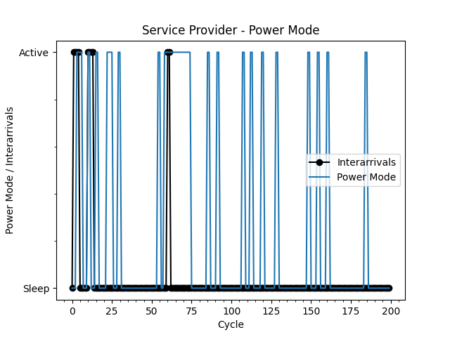

# Dynamic Power Management (DPM)

A Dynamic Power Management algorithm using Reinforcement Learning for IoT devices is impemented in this project.

# Definitions 

- Service Provider - Peripheral devices also known as input/output devices.
- Service Requester - The software application that accesses the peripheral device.
- Service Request Queue - Requests to the peripheral device are buffered in a service request queue.

# Results

### Service Provider - Power Cost

### Service Provider - Power Mode

### Service Queue - Requests

### Q-values

#### Service Provider - Active State (Power Mode)
                                    ACTION TO TAKE
        Environment State       go_active   go_sleep
    (sp=active,sr=idle,sq=0)    13.800547   12.953224
    (sp=active,sr=idle,sq=1)    0.000000    0.000000
    (sp=active,sr=idle,sq=2)    11.816800   12.159923
    (sp=active,sr=idle,sq=3)    16.309538   0.000000
    (sp=active,sr=idle,sq=4)    18.289108   17.404607
    (sp=active,sr=idle,sq=5)    17.755421   0.000000
    (sp=active,sr=idle,sq=6)    0.000000    0.000000
    (sp=active,sr=idle,sq=7)    20.594358   0.000000
    (sp=active,sr=idle,sq=8)    19.940160   0.000000
    (sp=active,sr=idle,sq=9)    0.000000    0.000000
    (sp=active,sr=idle,sq=10)   21.860160   0.000000
    (sp=active,sr=idle,sq=11)   0.000000    0.000000
    (sp=active,sr=low,sq=0)     13.070493   13.015622
    (sp=active,sr=low,sq=1)     15.052154   15.220875
    (sp=active,sr=low,sq=2)     16.146487   15.410084
    (sp=active,sr=low,sq=3)     17.138572   16.475900
    (sp=active,sr=low,sq=4)     17.185330   18.360759
    (sp=active,sr=low,sq=5)     19.743818   19.743740
    (sp=active,sr=low,sq=6)     20.524588   20.824947
    (sp=active,sr=low,sq=7)     20.232675   20.626111
    (sp=active,sr=low,sq=8)     23.051846   22.155787
    (sp=active,sr=low,sq=9)     23.911762   23.897186
    (sp=active,sr=low,sq=10)    22.734566   0.000000
    (sp=active,sr=low,sq=11)    0.000000    0.000000
    (sp=active,sr=high,sq=0)    14.189987   14.189954
    (sp=active,sr=high,sq=1)    13.220160   0.000000
    (sp=active,sr=high,sq=2)    15.222019   14.592725
    (sp=active,sr=high,sq=3)    15.206819   16.084565
    (sp=active,sr=high,sq=4)    0.000000    0.000000
    (sp=active,sr=high,sq=5)    17.060160   0.000000
    (sp=active,sr=high,sq=6)    18.620832   15.016800
    (sp=active,sr=high,sq=7)    18.980160   0.000000
    (sp=active,sr=high,sq=8)    0.000000    0.000000
    (sp=active,sr=high,sq=9)    21.043619   17.416800
    (sp=active,sr=high,sq=10)   18.216800   0.000000
    (sp=active,sr=high,sq=11)   19.016800   0.000000

#### Service Provider - Sleep State (Power Mode)

                                    ACTION TO TAKE
        Environment State       go_active   go_sleep
    (sp=sleep,sr=idle,sq=0)     2.260685    2.207559
    (sp=sleep,sr=idle,sq=1)     3.564108    3.564110
    (sp=sleep,sr=idle,sq=2)     5.252198    4.703468
    (sp=sleep,sr=idle,sq=3)     5.750767    5.750767
    (sp=sleep,sr=idle,sq=4)     6.894121    6.344838
    (sp=sleep,sr=idle,sq=5)     7.242297    7.786253
    (sp=sleep,sr=idle,sq=6)     8.235667    8.347533
    (sp=sleep,sr=idle,sq=7)     10.006192   9.989032
    (sp=sleep,sr=idle,sq=8)     0.000000    10.191368
    (sp=sleep,sr=idle,sq=9)     11.254450   11.441451
    (sp=sleep,sr=idle,sq=10)    9.766160    9.766160
    (sp=sleep,sr=idle,sq=11)    14.675179   14.675179
    (sp=sleep,sr=low,sq=0)      3.348165    2.636135
    (sp=sleep,sr=low,sq=1)      4.368183    4.708845
    (sp=sleep,sr=low,sq=2)      4.893086    5.508934
    (sp=sleep,sr=low,sq=3)      6.541229    5.390953
    (sp=sleep,sr=low,sq=4)      7.633232    6.441330
    (sp=sleep,sr=low,sq=5)      7.832752    9.141393
    (sp=sleep,sr=low,sq=6)      10.134768   10.261928
    (sp=sleep,sr=low,sq=7)      10.891713   9.532095
    (sp=sleep,sr=low,sq=8)      12.393245   10.505895
    (sp=sleep,sr=low,sq=9)      12.452868   11.765373
    (sp=sleep,sr=low,sq=10)     0.000000    11.719392
    (sp=sleep,sr=low,sq=11)     13.266401   13.501204
    (sp=sleep,sr=high,sq=0)     2.399152    2.251380
    (sp=sleep,sr=high,sq=1)     0.000000    0.000000
    (sp=sleep,sr=high,sq=2)     4.572592    4.295332
    (sp=sleep,sr=high,sq=3)     5.332685    5.330018
    (sp=sleep,sr=high,sq=4)     4.966160    4.966160
    (sp=sleep,sr=high,sq=5)     5.766160    5.766160
    (sp=sleep,sr=high,sq=6)     0.000000    0.000000
    (sp=sleep,sr=high,sq=7)     0.000000    0.000000
    (sp=sleep,sr=high,sq=8)     10.452685   10.452685
    (sp=sleep,sr=high,sq=9)     11.476685   11.399791
    (sp=sleep,sr=high,sq=10)    12.500685   12.266297
    (sp=sleep,sr=high,sq=11)    0.000000    0.000000

#### Service Provider - Transient State

                                    ACTION TO TAKE
        Environment State           go_active   go_sleep
    (sp=transient,sr=idle,sq=0)    0.028259  0.000000
    (sp=transient,sr=idle,sq=1)    0.285126  0.000000
    (sp=transient,sr=idle,sq=2)    0.323151  0.232548
    (sp=transient,sr=idle,sq=3)    0.460232  0.000000
    (sp=transient,sr=idle,sq=4)    0.136442  0.000000
    (sp=transient,sr=idle,sq=5)    0.607380  0.000000
    (sp=transient,sr=idle,sq=6)    0.823995  0.046626
    (sp=transient,sr=idle,sq=7)    0.161306  0.166277
    (sp=transient,sr=idle,sq=8)    0.000000  0.000000
    (sp=transient,sr=idle,sq=9)    0.990117  0.000000
    (sp=transient,sr=idle,sq=10)   0.000000  0.000000
    (sp=transient,sr=idle,sq=11)   0.000000  0.000000
    (sp=transient,sr=low,sq=0)     0.195682  1.258454
    (sp=transient,sr=low,sq=1)     0.436312  1.275525
    (sp=transient,sr=low,sq=2)     0.470173  1.298813
    (sp=transient,sr=low,sq=3)     0.457987  1.422647
    (sp=transient,sr=low,sq=4)     0.852546  1.511989
    (sp=transient,sr=low,sq=5)     0.783226  1.663673
    (sp=transient,sr=low,sq=6)     1.021857  0.407940
    (sp=transient,sr=low,sq=7)     1.159224  1.817497
    (sp=transient,sr=low,sq=8)     0.313115  1.953082
    (sp=transient,sr=low,sq=9)     1.206384  2.148276
    (sp=transient,sr=low,sq=10)    0.000000  0.000000
    (sp=transient,sr=low,sq=11)    1.279059  0.012097
    (sp=transient,sr=high,sq=0)    0.000000  1.171056
    (sp=transient,sr=high,sq=1)    0.000000  0.000000
    (sp=transient,sr=high,sq=2)    0.000000  0.000000
    (sp=transient,sr=high,sq=3)    0.130651  1.307052
    (sp=transient,sr=high,sq=4)    0.476751  0.000000
    (sp=transient,sr=high,sq=5)    0.000000  0.000000
    (sp=transient,sr=high,sq=6)    0.000000  1.201344
    (sp=transient,sr=high,sq=7)    0.000000  0.000000
    (sp=transient,sr=high,sq=8)    0.836215  0.000000
    (sp=transient,sr=high,sq=9)    0.717293  0.000000
    (sp=transient,sr=high,sq=10)   0.000000  0.196261
    (sp=transient,sr=high,sq=11)   0.000000  0.000000

# Explanation

This algorithm models a [Texas Instrument CC2652R7 Wireless MCU](https://www.ti.com/product/CC2652R7#product-details) 
as a Service Provider, an iOS application as a Service Requester that makes requests to access the Bluetooth component 
of the CC2652R7 peripheral device, and the requests are buffered in a Service Queue of length N=12. 

The goal of the algorithm is to determine the optimum policy for minimizing the system cost between the electrical power utilized by the service provider and the performance of processing the requests of a service requester. Performance is measured as the number of requests waiting to be processed in the service queue and power is measured as the electrical energy spent in a given power-mode. Requests to the servier provider are modeled as iterarrivals which represent the time of arrival a request to access the service provider has been detected. In practice the reinforcement learning agent takes an action, observes the cost for taking the action, and updates the action's q-value.

This algorithm models a service provider which contains an active power-mode and sleep power-mode, the service requester can either request access to the service provider in a low, high, or idle frequency, finally the requests are buffered in the service queue which can be of length N.

The [results](#results) section compares the Dynamic Power Management algorithm policy implemented using a Reinforcement Learning agent
to a generic policy of immediately processing requests when they arrive then going directly into a sleep state. The DPM algorithm 
achieved to decrease the power utilization by ~150% and roughly kept 2.66 requests waiting in the service queue.

### Agent & Environment

_source: [1]_

### Environment States

_source: [1]_

### Q Value Function

_source: [1]_

# References

1. Hao Shen, Ying Tan, Jun Lu, Qing Wu, and Qinru Qiu. 2013. Achieving autonomous power management using reinforcement 
learning. ACM Trans. Des. Autom. Electron. Syst. 18, 2, Article 24 (March 2013), 32 pages. 
DOI:https://doi.org/10.1145/2442087.2442095
